# remote_vrc_chatbox for Android

flutterってクロスプラットフォームやろ！！と思ったあなた、apple製品を一つも持っていないので…
## なにこれ？

スマホからVRChatのチャットボックスに文字を飛ばせます。

 → 

## notice

> [!NOTE]
> QUEST単機でも使えるよ！
>   
> [事前準備>アプリ側 (IP設定)](#事前準備) に入れるIPアドレスを [quest ip searcher](https://github.com/wi11oh/search_quest_IP) で取得してね

> [!NOTE]
> windows側にも何かインストールする感じ？
>   
> ***入れなくても動きます！！！*** スマホにアプリインストールして文字打つだけ！　【nomalモード】
>   
> でも一緒に配布してる rVRCc server ってやつをwindowsに入れるてるとクリップボード共有ができてスマホからiwasyncとかにURL貼り付けれるので便利！！！ 　【advansedモード】

## 事前準備

### - アプリ側 (IP設定)
初回はVRChatが動いているPCの(ローカル)IPアドレスの設定が必要です

- 設定場所はドロワー最上部、IP設定をタップし、ローカルIPアドレスを入力

> [!TIP]
> PCVRの場合のIPアドレスの調べ方 -> [ここ](http://wi11oh.com/other/remote_vrc_chatbox_tips)を参考に取得
>  
> QUEST単機の場合のIPアドレスの調べ方 -> [ツール](https://github.com/wi11oh/search_quest_IP)を使って取得

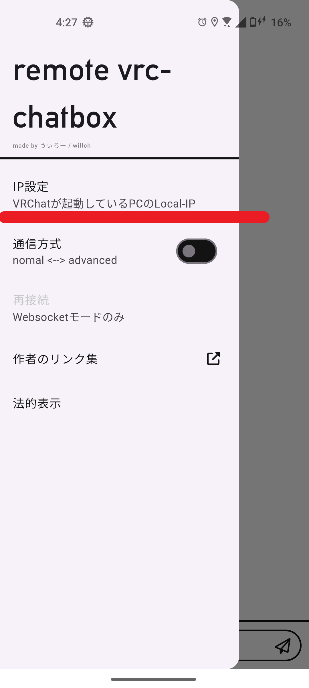 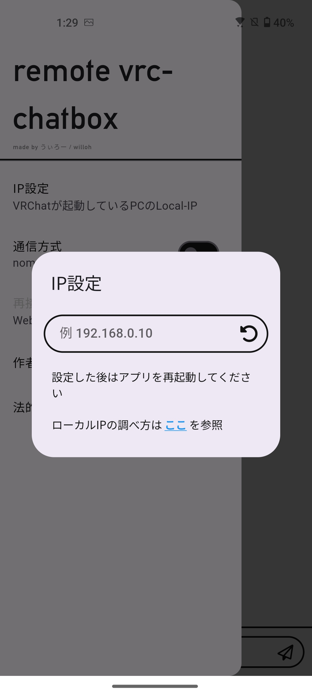 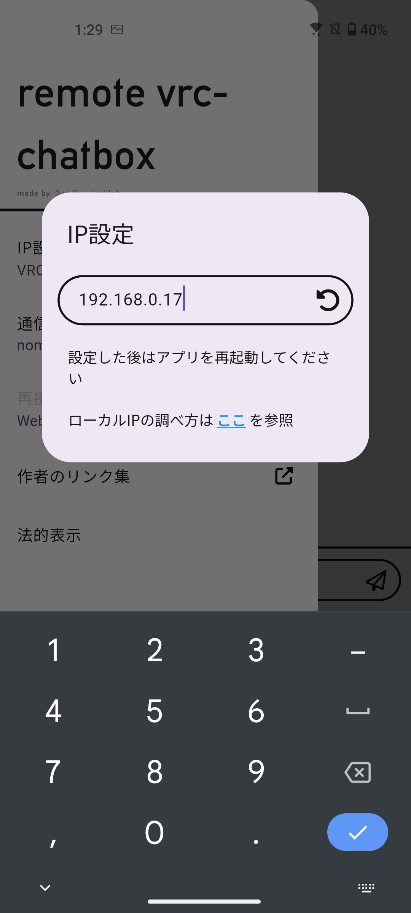

### - VRChat側 (OSCを有効化)
VRC側のパイメニューでOSCをEnabled（右側）にしておいてください

  

## 機能

### - 履歴参照と編集

セッション中(アプリ閉じるまで)は履歴が蓄積されます。typoなどがあった時や同じことを発言したいときは履歴カードの右のペンアイコンをタップすると入力欄にコピーされます。

### - プッシュトゥトークの音声認識

左下のマイクアイコンを押している間ずっと音声認識をします。意図せず音声認識を切り上げられたりしません。

ポタンから指を離すと自動的に送信されるので話のテンポを乱しません。

### - 被共有

youtubeやブラウザで選択した文字を共有すると自動で起動して入力欄に挿入されます。クリップボード送信と合わせてご利用していただくと便利です

- youtubeの例

    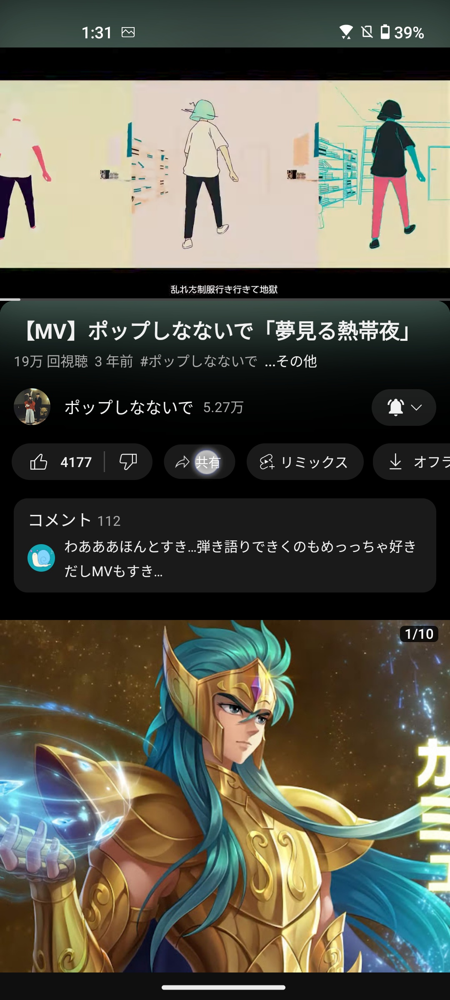 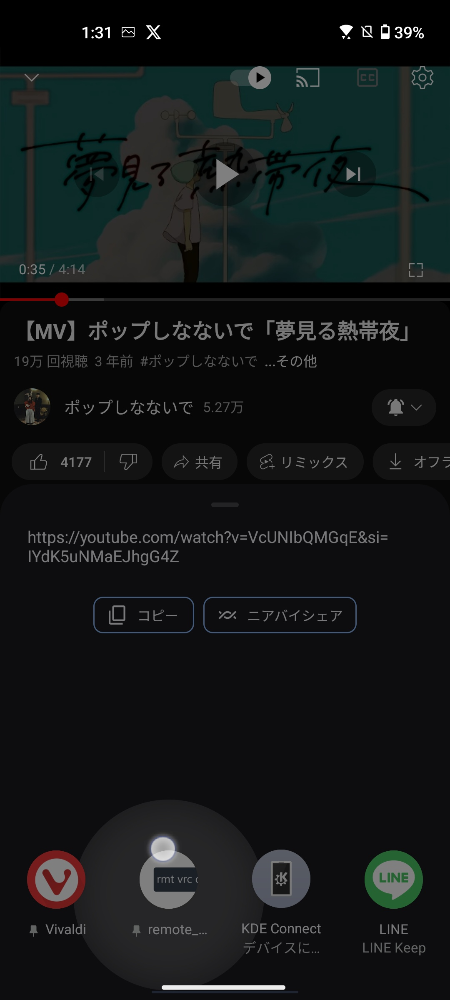 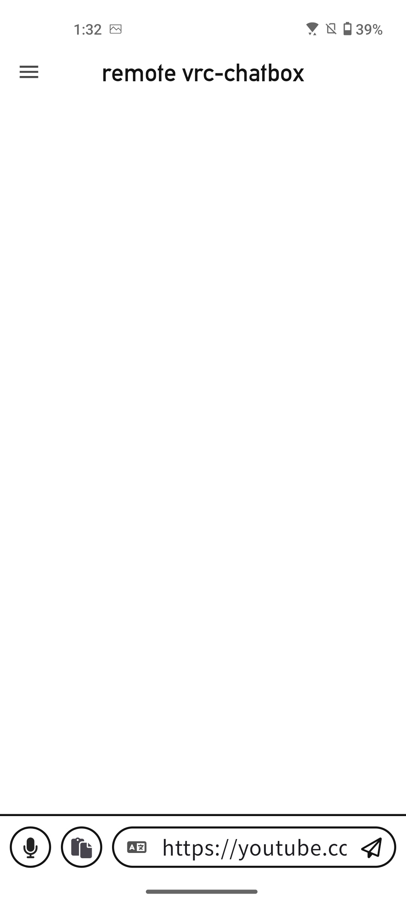

- ブラウザの例

    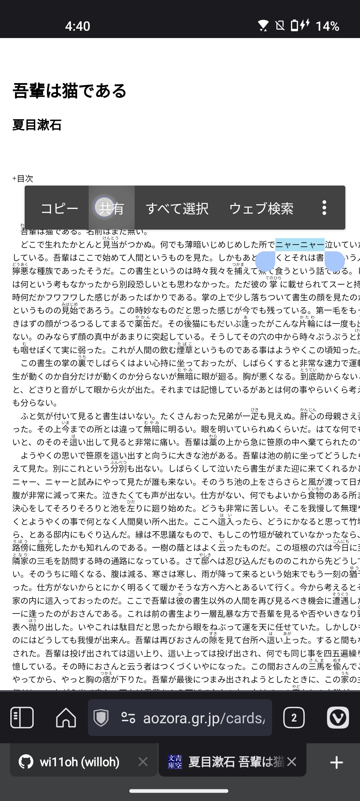 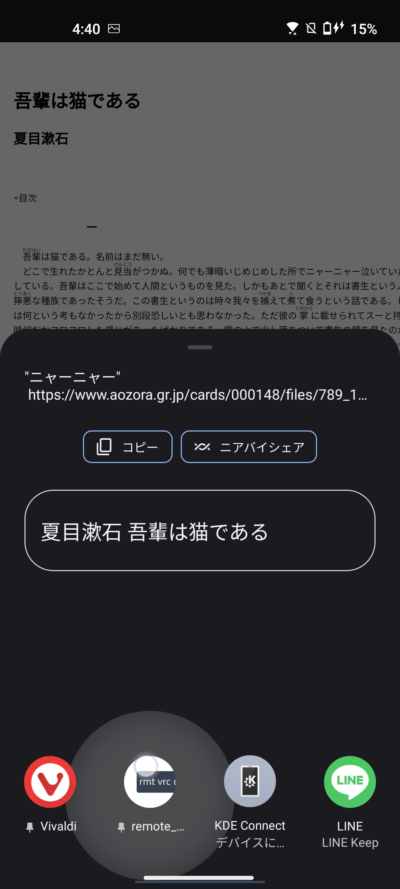 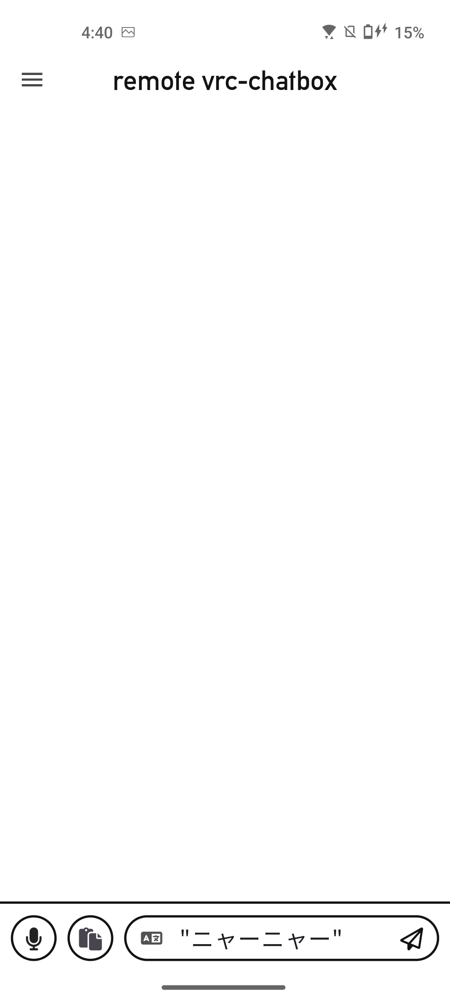

### - 日英翻訳

- gif参照

    

### - 画面分割対応

- twitterやブラウザなどを使いながらチャットボックスの送信ができます

    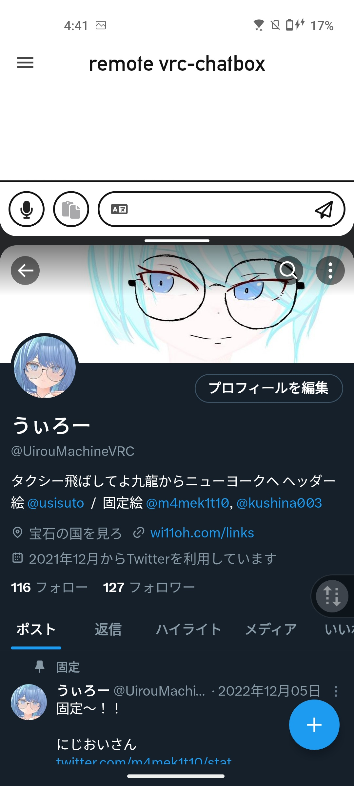

### - クリップボード送信

> [!NOTE]
> windows側で rVRCc_server を動かしていて、且つ通信方式を 【advancedモード】 にしている時限定で利用できる機能です。 【nomalモード】 ではボタンがホワイトアウトしています。

- モード切り替えはドロワーにあります

    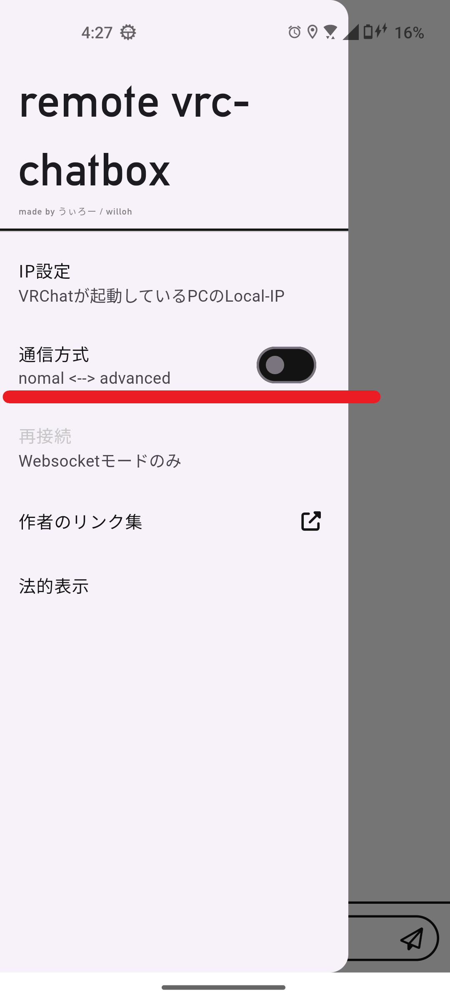

- スマホ → PC

      

    - VRChatが 入力欄にURL等文字列を入力しクリップボードボタンを押すと、PC側でのクリップボードが更新され、貼り付けボタンで入力できます。
    - iwasyncなどのプレイヤーにURLを貼ったり、ワールド検索などに使えます。

- PC → スマホ

    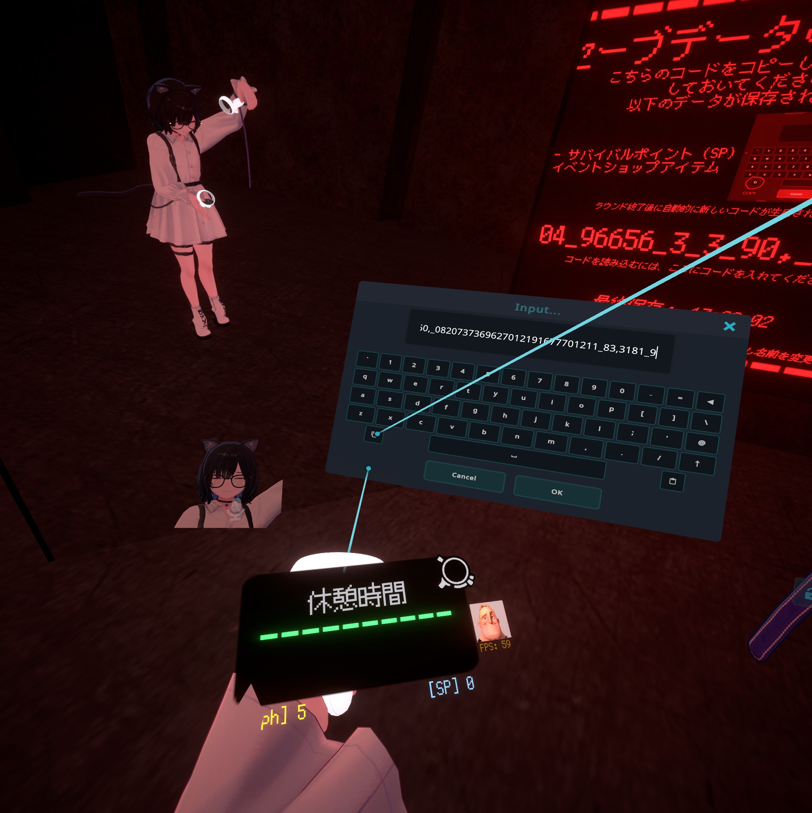 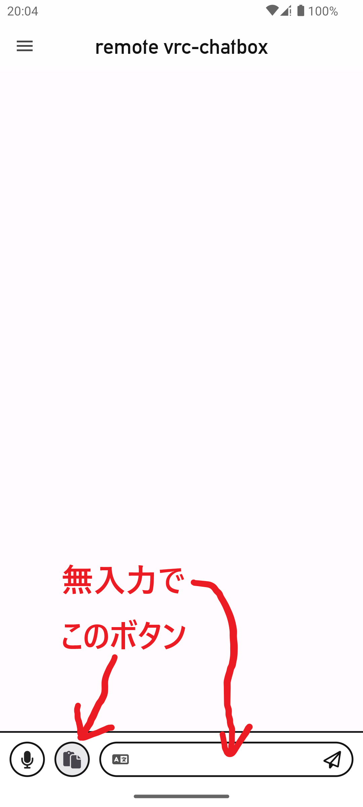 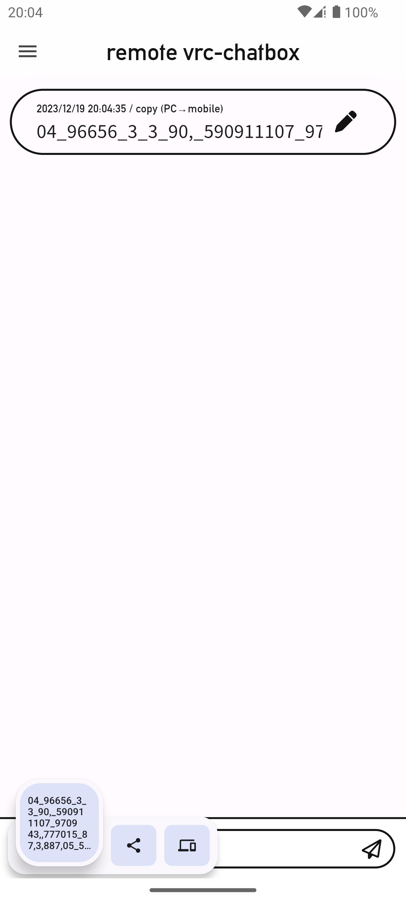

    - 文字入力欄に何も入力していないとPC側のクリップボードを読み取り、スマホ側のクリップボードに挿入されます。
    - TONなどの復活の呪文形式のセーブ機能があるワールドの呪文をスマホに素早く保存できます

## rVRCc_server について

> [!NOTE]
> ***前述の通りクリップボード共有機能を使わないのであれば必要ありません。***

> [!WARNING]
> 起動してもウィンドウは出ません。多重起動に気をつけてください

> [!TIP]
> スタートアップ登録しておくと便利です。 ( [参考](https://support.microsoft.com/ja-jp/windows/windows-10-%E3%81%AE%E8%B5%B7%E5%8B%95%E6%99%82%E3%81%AB%E8%87%AA%E5%8B%95%E7%9A%84%E3%81%AB%E5%AE%9F%E8%A1%8C%E3%81%99%E3%82%8B%E3%82%A2%E3%83%97%E3%83%AA%E3%82%92%E8%BF%BD%E5%8A%A0%E3%81%99%E3%82%8B-150da165-dcd9-7230-517b-cf3c295d89dd) )

- 起動中はタスクトレイにこのアイコンが出ます。右クリック→終了するを押すとVRChatが起動していても終了します。

     

- 見つからない場合は　^　アイコンの中に隠れてるかも

    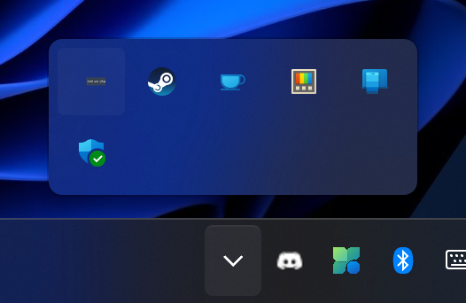

## TODO(今後予定)

- 内部データベース実装でセーブデータを呼び出せるようにしたい
- 音声入力中は文字枠が右詰めで移動させたい
- サーバー側をpythonからgolangで書き直したい

## ダウンロード

[>>> こちら <<<](https://github.com/wi11oh/android_remote_vrc_chatbox/releases)
