# remote_vrc_chatbox for Android

flutterってクロスプラットフォームやろ！！と思ったあなた、apple製品を一つも持っていないので…
## なにこれ？

スマホからVRChatのチャットボックスに文字を飛ばせます。

 → 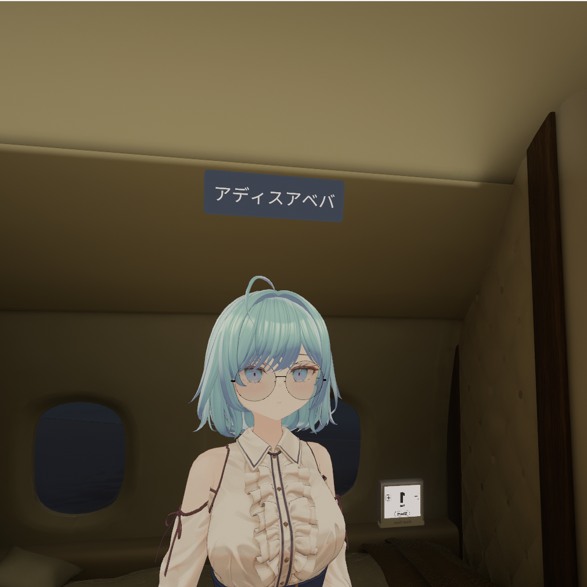

## windows側にも何かインストールする感じ？

***入れなくても動きます！！！*** スマホにアプリインストールして文字打つだけ！　【OSCモード】

でも一緒に配布してる rVRCc server ってやつをwindowsに入れるてるとクリップボード共有ができてスマホからiwasyncとかにURL貼り付けれるので便利！！！ 　【websocketモード】

## 事前準備

VRC側のパイメニューでOSCをEnable（右側）にしておいてください

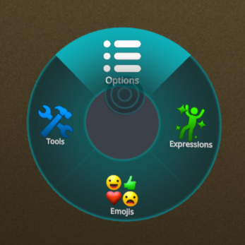 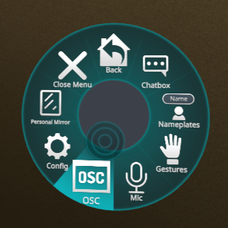 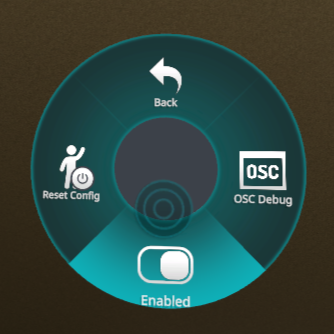

## 機能

### - 履歴参照と編集

セッション中(アプリ閉じるまで)は履歴が蓄積されます。typoなどがあった時や同じことを発言したいときは履歴カードの右のペンアイコンをタップすると入力欄にコピーされます。

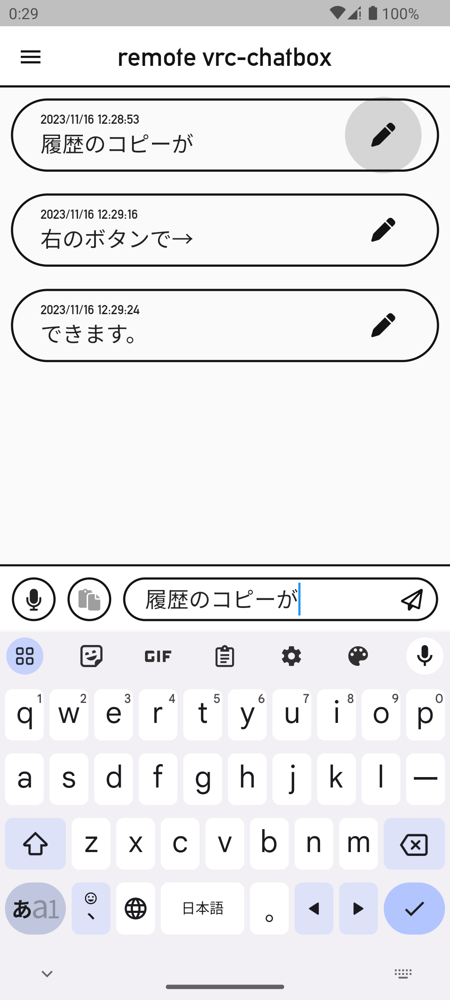

### - プッシュトゥトークの音声認識

左下のマイクアイコンを押している間ずっと音声認識をします。意図せず音声認識を切り上げられたりしません。

ポタンから指を離すと自動的に送信されるので話のテンポを乱しません。

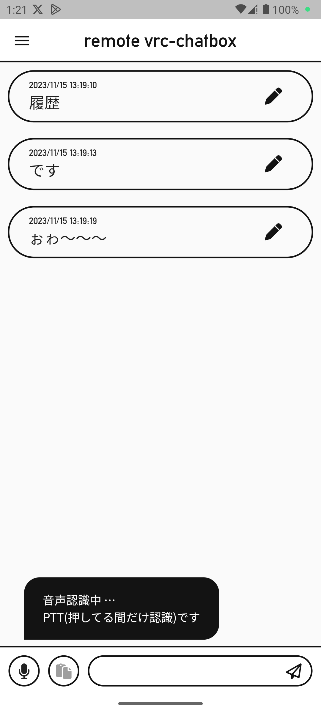

### - 被共有

youtubeやブラウザで選択した文字を共有すると自動で起動して入力欄に挿入されます。クリップボード送信と合わせてご利用していただくと便利です

- youtubeの例

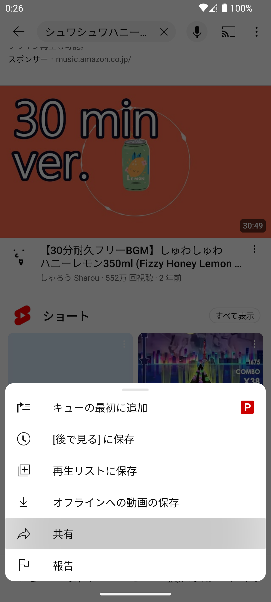 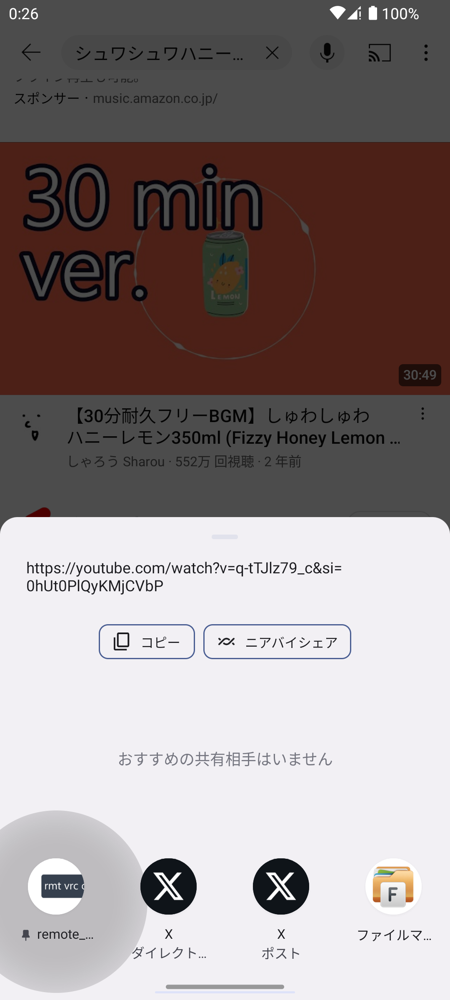 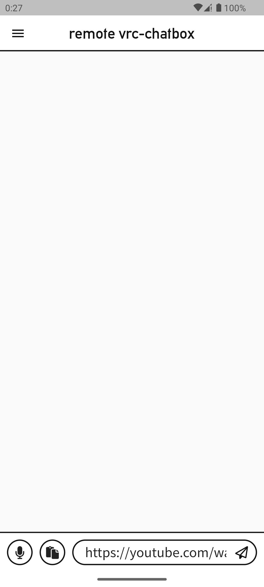

-ブラウザの例

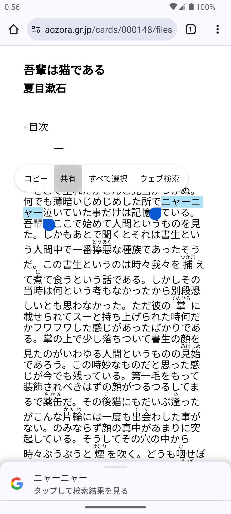 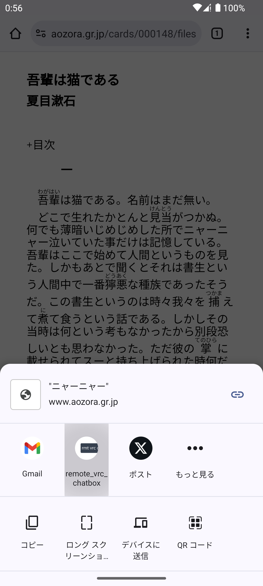 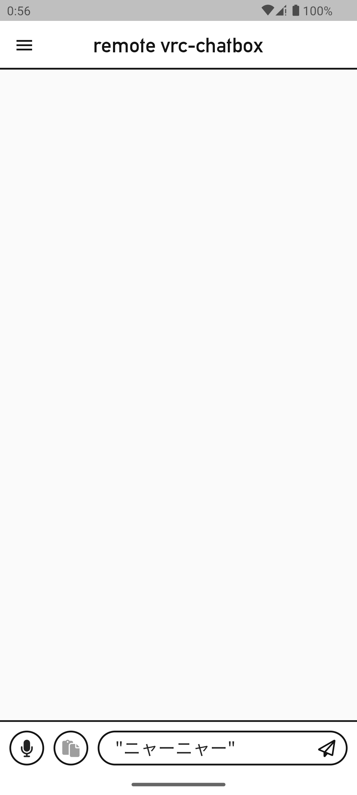

### - 日英翻訳

gif参照

### - クリップボード送信

windows側で rVRCc_server を動かしていて、且つ通信方式を 【websocketモード】 にしている時限定で利用できる機能です。 【OSCモード】 ではボタンがホワイトアウトしています。

- モード切り替えはドロワーにあります

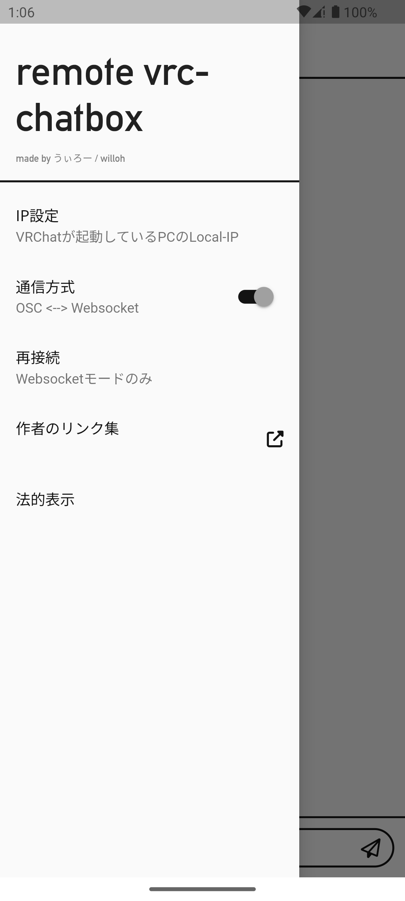

- VRChatが 入力欄にURL等文字列を入力しクリップボードボタンを押すと、PC側でのクリップボードが更新され、貼り付けボタンで入力できます。

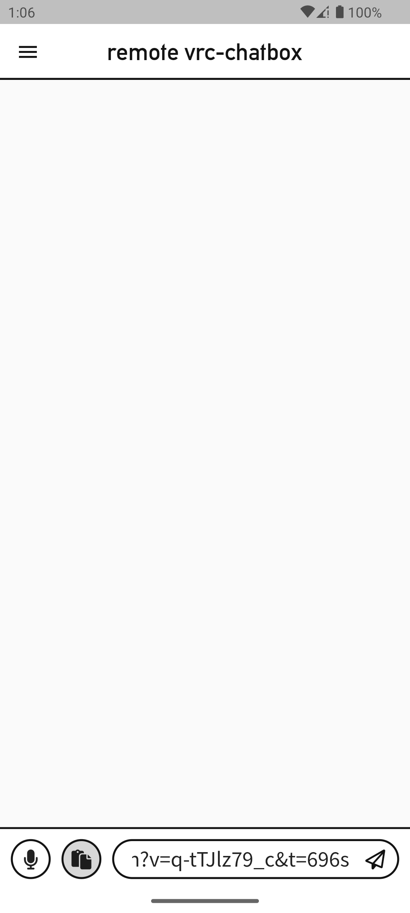 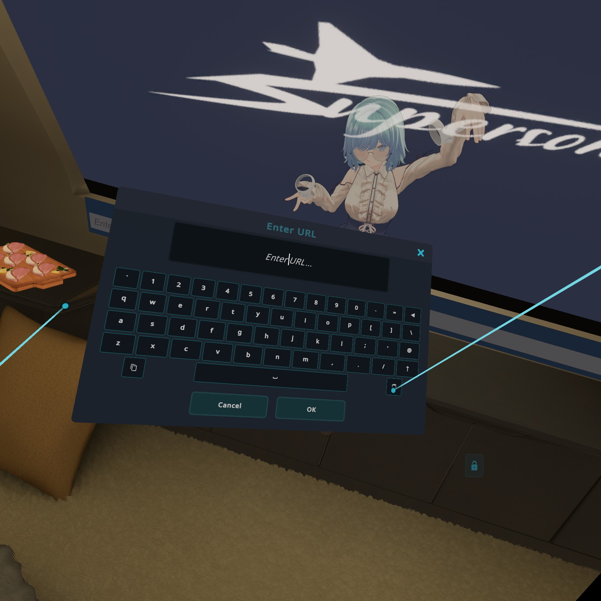 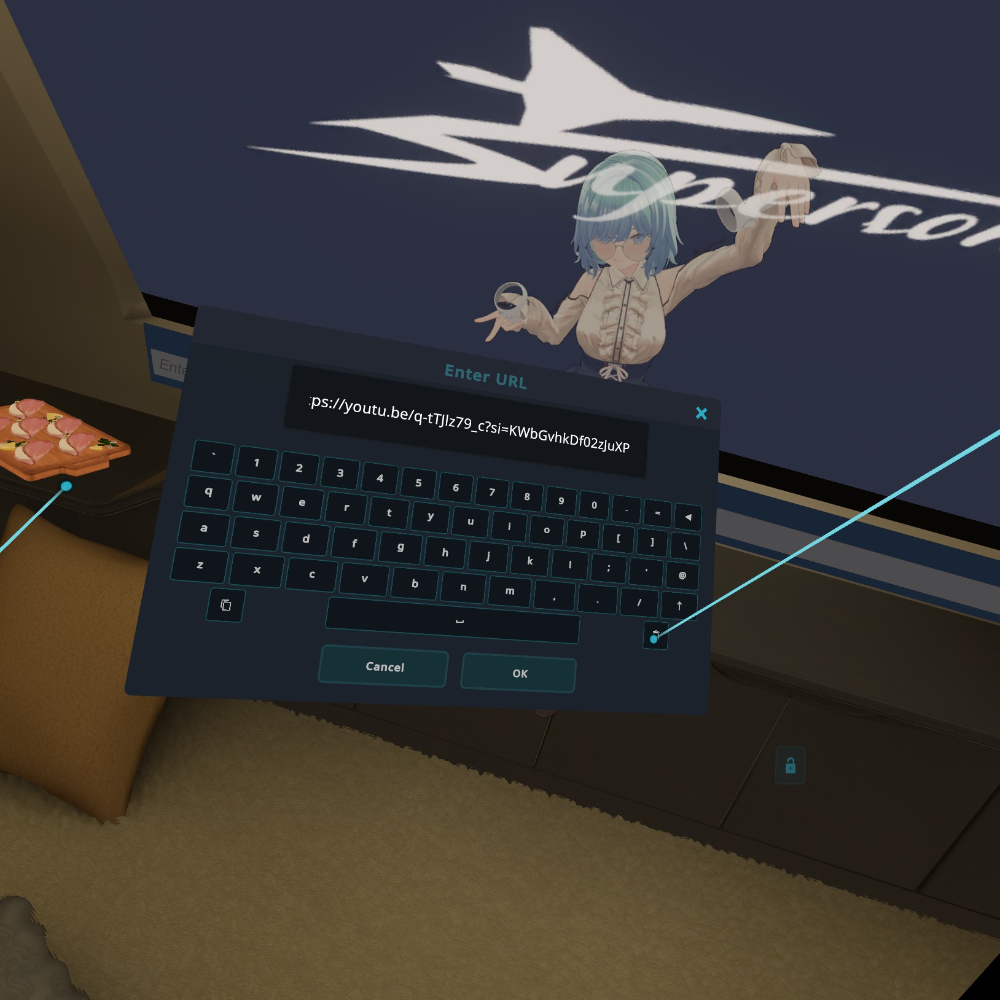

## rVRCc_server について

ℹ ***前述の通りクリップボード共有機能を使わないのであれば必要ありません。***

- VRChatが起動したのを検知すると自動で立ち上がり、逆にVRChatの終了を検知すると自動で終了します。

- 起動中はタスクトレイにこのアイコンが出ます。右クリック→終了するを押すとVRChatが起動していても終了します。

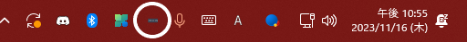 

## IP設定について

初回はVRChatが動いているPCの(ローカル)IPアドレスの設定が必要です

- 設定場所はドロワー最上部、IP設定をタップし、[IPアドレス](http://wi11oh.com/other/remote_vrc_chatbox_tips)を入力

 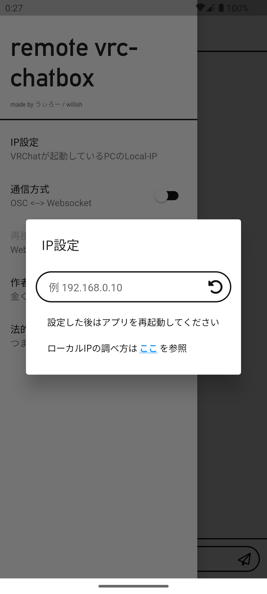 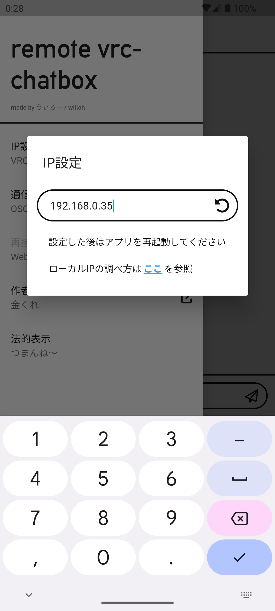

## TODO(今後予定)

- クリップボード共有ボタンを入力欄が空の状態で押すとPC側のクリップボードを取得する機能を付けたい

## ダウンロード

⚠ ベータ版ですので何かあっても責任取れません ⚠

[ここ](https://github.com/wi11oh/android_remote_vrc_chatbox/releases)
